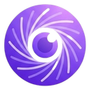
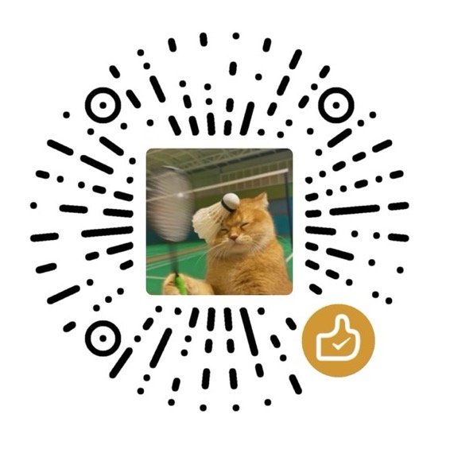

# Ophel Atlas 🚀

> AI チャットをドキュメントのように読みやすく、ナビゲートしやすく、再利用可能に

<div align="center">
  

  <h3 style="margin-top: -2px;">✨ 会話をただの履歴ではなく、知識へ ✨</h3>
  
  <p>
    無限スクロールによる情報の迷宮に別れを告げよう
    </br>
    リアルタイムのアウトラインで文脈を整理し、
    </br>
    会話フォルダで体系を構築し、
    </br>
    プロンプトライブラリで経験を蓄積し、
    </br>
    煌めく思考を秩序の中で自由に解き放とう
  </p>
  
  <p align="center" style="font-size: 12px; color: #555;">👇 デモ：「無限スクロールのチャット履歴」から「ナビ可能なAIドキュメント」へ</p>


  <p>
    <strong><em>AIチャットを初めて「整理可能なワークフロー」にします</em></strong><br/>
  </p>

  <small style="opacity: 0.6;">
  どのプラットフォームを使用していても、一貫した、整理可能で再利用可能な体験を得ることができます
  </small>
  <p>
    <a href="https://chatgpt.com"></a>
    <a href="https://gemini.google.com"></a>
    <a href="https://claude.ai"></a>
    <a href="https://aistudio.google.com"></a>
    <a href="https://business.gemini.google/"></a>
    <a href="https://grok.com"></a>
    <!-- <a href="https://github.com/urzeye/ophel/issues"></a> -->
    <br/>
    <a href="https://www.doubao.com"></a>
    <a href="https://chat.deepseek.com"></a>
    <a href="https://www.kimi.com"></a>
    <a href="https://chat.z.ai"></a>
    <a href="https://chatglm.cn/main/alltoolsdetail?lang=zh"></a>
    <a href="https://www.qianwen.com"></a>
    <a href="https://chat.qwen.ai"></a>
    <a href="https://yuanbao.tencent.com"></a>
    <a href="https://ima.qq.com"></a>
    </br>
    
    <a href="../../LICENSE"></a>
    
    <a href="https://github.com/urzeye/ophel/stargazers"></a>
    <a href="https://github.com/urzeye/ophel/network/members"></a>
    </br>
    <a href="https://chromewebstore.google.com/detail/ophel-ai-%E5%AF%B9%E8%AF%9D%E5%A2%9E%E5%BC%BA%E5%B7%A5%E5%85%B7/lpcohdfbomkgepfladogodgeoppclakd"></a>
    <a href="https://microsoftedge.microsoft.com/addons/detail/ophel-atlas-ai-chat-navi/ffpenkdeifijngifjmbbpijfpdhlolga"></a>
    <a href="https://addons.mozilla.org/zh-CN/firefox/addon/ophel-ai-chat-enhancer/"></a>
    <a href="https://greasyfork.org/zh-CN/scripts/563646-ophel-ai-chat-page-enhancer"></a>
  </p>

</div>

<!-- Promo Link -->
<p align="center">
  📣 <a href="https://github.com/urzeye/ophel/issues/30">
    <strong>Help promote Ophel Atlas</strong>
  </a>
</p>

<p align="center">
  <a href="#-デモ">デモ</a> •
  <a href="#-主な機能">主な機能</a> •
  <a href="#-今すぐ始める">今すぐ始める</a> •
  <a href="#-ophel-atlas-をサポート">Ophel Atlas をサポート</a> •
  <a href="#-参加する">参加する</a>
</p>

<p align="center">
  🌐 <a href="../../README.md">English</a> | <a href="../../README_zh-CN.md">简体中文</a> | <a href="./README_zh-TW.md">繁體中文</a> | <strong>日本語</strong> | <a href="./README_ko.md">한국어</a> | <a href="./README_de.md">Deutsch</a> | <a href="./README_fr.md">Français</a> | <a href="./README_es.md">Español</a> | <a href="./README_pt-BR.md">Português</a> | <a href="./README_ru.md">Русский</a>
</p>

## 📹 デモ

|                                                        大綱 Outline                                                        |                                                     会話 Conversations                                                     |                                                       機能 Features                                                        |
| :------------------------------------------------------------------------------------------------------------------------: | :------------------------------------------------------------------------------------------------------------------------: | :------------------------------------------------------------------------------------------------------------------------: |
| <video src="https://github.com/user-attachments/assets/a40eb655-295e-4f9c-b432-9313c9242c9d" width="280" controls></video> | <video src="https://github.com/user-attachments/assets/a249baeb-2e82-4677-847c-2ff584c3f56b" width="280" controls></video> | <video src="https://github.com/user-attachments/assets/6dfca20d-2f88-4844-b3bb-c48321100ff4" width="280" controls></video> |

## ✨ 主な機能

> 学習・研究、要件分析、コード議論、コンテンツ制作など、「構造・秩序・再利用」が求められるあらゆる AI 対話シーンに最適です。

<table>
  <thead>
    <tr>
      <th width="200">機能</th>
      <th>説明</th>
    </tr>
  </thead>
  <tbody>
    <tr>
      <td>🧭 <a href="https://ophel.app/docs/features/outline">スマートアウトライン</a></td>
      <td>対話構造をリアルタイム解析しナビゲーション可能な目次を生成。階層折りたたみ、検索ジャンプ、アンカー、ブックマーク、文字数カウントに対応</td>
    </tr>
    <tr>
      <td>💬 <a href="https://ophel.app/docs/features/conversations">会話管理</a></td>
      <td>フォルダ + タグの二次元管理、ソースサイトとの自動同期、検索・一括操作・複数形式エクスポート（Markdown/JSON/TXT、分割エクスポート）</td>
    </tr>
    <tr>
      <td>💡 <a href="https://ophel.app/docs/features/prompts">プロンプトライブラリ</a></td>
      <td>変数テンプレート、分類管理、ワンクリック入力、ダブルクリック送信、プロンプトキューによる自動連続送信</td>
    </tr>
    <tr>
      <td>🔍 <a href="https://ophel.app/docs/features/global-search">グローバル検索</a></td>
      <td>会話/アウトライン/プロンプト/設定を横断検索、<code>folder:</code> <code>tag:</code> <code>date:</code> 構文フィルターとあいまい検索に対応</td>
    </tr>
    <tr>
      <td>📖 <a href="https://ophel.app/docs/enhancements/content">読書体験</a></td>
      <td>Mermaid 図表レンダリング、LaTeX 数式サポート、ユーザー質問の Markdown 整形、スクロールロック</td>
    </tr>
    <tr>
      <td>⌨️ <a href="https://ophel.app/docs/customization/shortcuts">効率化ツール</a></td>
      <td>読書履歴の復元、カスタムショートカット、モデルロック、タブ名の拡張、AI 完了通知</td>
    </tr>
    <tr>
      <td>🎨 <a href="https://ophel.app/docs/customization/appearance">テーマ</a></td>
      <td>20+ テーマ、カスタム CSS、ワイドスクリーンモード、禅モード、<code>Option+D</code> でダーク/ライト切替</td>
    </tr>
    <tr>
      <td>📊 <a href="https://ophel.app/docs/panel-overview">データ統計</a></td>
      <td>ローカル対話カウンター、トークン概算、履歴チャート（サイト別/時間別）</td>
    </tr>
    <tr>
      <td>🎭 <a href="https://ophel.app/docs/customization/site-settings">Claude 拡張</a></td>
      <td>Session Key 管理とマルチアカウント切り替え</td>
    </tr>
    <tr>
      <td>🔒 <a href="https://ophel.app/docs/data/privacy">プライバシーとデータ</a></td>
      <td>デフォルトでローカル保存、WebDAV マルチデバイス同期、ファイルインポート/エクスポート、データ収集なし</td>
    </tr>
  </tbody>
</table>

<p align="right"><a href="https://ophel.app/docs/introduction">📖 完全なドキュメント →</a></p>

> [!IMPORTANT]
>
> **Ophel Atlas** はプライバシー最優先：既定はローカル保存で、データはあなたの管理下にあります。
>
> - **既定でローカル保存：** 設定・プロンプト・会話管理データはブラウザ内に保存
> - **アカウント不要：** 登録なしで利用可能
> - **必要時のみ権限：** オプション権限は必要時だけ要求し、いつでも取り消し可能（拡張機能の Permissions ページ参照）
> - **任意の WebDAV 同期：** 自分の WebDAV で複数端末同期（管理可能・移行容易）
> - **エクスポート/バックアップ：** 書き出しと移行に対応、ロックイン回避
>
> _注：特定のAIサイトへの対応は、サイト判定とページ構造の変更に依存します。_

## 🚀 今すぐ始める

> [!tip]
>
> **ブラウザ拡張機能（Extension）版の使用を推奨します**。機能が充実しており、体験も優れ、互換性も高いです。Tampermonkey（Userscript）版は機能が制限されています。

<a href="https://chromewebstore.google.com/detail/ophel-ai-%E5%AF%B9%E8%AF%9D%E5%A2%9E%E5%BC%BA%E5%B7%A5%E5%85%B7/lpcohdfbomkgepfladogodgeoppclakd"></a>
<a href="https://microsoftedge.microsoft.com/addons/detail/ophel-atlas-ai-chat-navi/ffpenkdeifijngifjmbbpijfpdhlolga"></a>
<a href="https://addons.mozilla.org/zh-CN/firefox/addon/ophel-ai-chat-enhancer/"></a>
<a href="https://greasyfork.org/zh-CN/scripts/563646-ophel-ai-chat-page-enhancer"></a>

<details>
<summary><strong>手動インストール (ストアにアクセスできない、またはオフライン環境)</strong></summary>


#### ブラウザ拡張機能

1. [Releases](https://github.com/urzeye/ophel/releases/latest) からインストールパッケージをダウンロードして解凍します
2. ブラウザの拡張機能管理ページを開き、**デベロッパーモード**を有効にします
3. **パッケージ化されていない拡張機能を読み込む**をクリックし、解凍したフォルダを選択します

#### Tampermonkey スクリプト

1. [Tampermonkey](https://www.tampermonkey.net/) プラグインをインストールします
2. [Releases](https://github.com/urzeye/ophel/releases) から `.user.js` ファイルをダウンロードします
3. ブラウザにドラッグするか、リンクをクリックしてインストールします


</details>

## 🙌 Ophel Atlas をサポート

<!-- supporters:start -->

<!-- This block is auto-generated by `pnpm supporters:sync`. Do not edit manually. -->

### 💖 特別な感謝

<p align="center">
  <a href="https://github.com/treasuresure">
    <br />
    <sub><b>treasuresure</b></sub>
  </a>
</p>

### 🌟 支援者

<table align="center">
  <tbody>
  <tr>
    <td align="center" valign="top" width="14.28%">
      <br />
      <sub><b>Hugh</b></sub>
    </td>
    <td align="center" valign="top" width="14.28%">
      <br />
      <sub><b>**南</b></sub>
    </td>
    <td align="center" valign="top" width="14.28%">
      <br />
      <sub><b>anonymous</b></sub>
    </td>
    <td align="center" valign="top" width="14.28%">
      <br />
      <sub><b>狷客行舟🍜狂？</b></sub>
    </td>
    <td align="center" valign="top" width="14.28%">
      <br />
      <sub><b>**煜</b></sub>
    </td>
    <td align="center" valign="top" width="14.28%">
      <a href="https://github.com/Ice-wilderness">
        <br />
        <sub><b>Ice_wilderness</b></sub>
      </a>
    </td>
    <td align="center" valign="top" width="14.28%">
      <a href="https://github.com/t0ny-peng">
        <br />
        <sub><b>Jeff Peng</b></sub>
      </a>
    </td>
  </tr>
  <tr>
    <td align="center" valign="top" width="14.28%">
      <br />
      <sub><b> 火华兰樱</b></sub>
    </td>
    <td align="center" valign="top" width="14.28%">
      <br />
      <sub><b>Lewu Gao</b></sub>
    </td>
    <td align="center" valign="top" width="14.28%">
      <br />
      <sub><b>爱发电用户_AYsw</b></sub>
    </td>
    <td align="center" valign="top" width="14.28%">
      <br />
      <sub><b>Steel Maestro</b></sub>
    </td>
  </tr>
  </tbody>
</table>

<!-- supporters:end -->

---

<p align="center">
  <em><strong>Ophel Atlas</strong> があなたのワークフローに喜びをもたらしたり、貴重な時間を節約できたなら、<strong>Star</strong> や <strong>Sponsor</strong> でその旅を応援していただけると嫌しいです。</em> ☕️
</p>

<p align="center">
  <strong>シェアも同じくらい力になります：</strong><strong>Linux.do、Reddit、X、YouTube</strong> などで体験を共有していただけると嫌しいです。すべてのフィードバックと応援が Ophel の成長を支えています！
</p>

<p align="center">
  <a href="https://ko-fi.com/urzeye">
    
  </a>
</p>


<table align="center" border="0" cellpadding="16" cellspacing="0">
  <tr>
    <td align="center">
      <br />
      <sub><b>WeChat Pay</b></sub>
    </td>
    <td align="center">
      <br />
      <sub><b>Alipay</b></sub>
    </td>
    <td align="center">
      <a href="https://afdian.com/a/urzeye">
        <picture>
          <source media="(prefers-color-scheme: dark)" srcset="https://afdian-connect.deno.dev/profile.svg?slug=urzeye&bg_color=%230d1117&text_color=%23dedbd7&border_color=%232e343d" />
          <source media="(prefers-color-scheme: light)" srcset="https://afdian-connect.deno.dev/profile.svg?slug=urzeye" />
          
        </picture>
      </a><br />
      <sub><b>Afdian</b></sub>
    </td>
  </tr>
</table>

## 🤝 参加する

<p align="center">
  <em>「速く行きたければ一人で行け。遠くへ行きたければみんなで行け。」</em>
</p>

<p align="center">
  <a href="https://linux.do/">Linux.do</a> コミュニティの議論とサポートに感謝します。多くのアイデアや改善はコミュニティからの熱心なフィードバックに由来しています。<br>
  より多くの開発者の参加を歓迎します。コードベースに不慣れな場合は、開発ドキュメントや AI アシスタントを利用して素早く始めることができます：
</p>

<p align="center">
  <a href="https://ophel.app/docs"></a>
  &nbsp;
  <a href="https://deepwiki.com/urzeye/ophel"></a>
  &nbsp;
  <a href="https://zread.ai/urzeye/ophel"></a>
</p>

<p align="center">
  <a href="https://github.com/urzeye/ophel/issues/new/choose"></a>
  &nbsp;
  <a href="https://github.com/urzeye/ophel/pulls"></a>
</p>

<details>
<summary><strong>💻 ローカル開発ビルドガイド</strong></summary>

<br>

**環境要件**: `Node.js >= 18.x`, `pnpm >= 9.x`

```bash
# 1. リポジトリをクローンし、プロジェクト・ディレクトリに入る
git clone https://github.com/urzeye/ophel.git
cd ophel

# 2. 依存関係のインストール
pnpm install

# 3. 開発サーバーの起動（ブラウザ拡張機能のホットリロードをサポート）
pnpm dev

# ======== ビルドとパッケージ化 ========

# 各ブラウザ用のプロダクション版をビルド
pnpm build              # Chrome 拡張機能のビルド
pnpm build:firefox      # Firefox 拡張機能のビルド
pnpm build:all          # メインブラウザ向け拡張機能を一括ビルド

# 配布用アーカイブ (.zip) の作成
pnpm package            # 既存のビルドから Chrome 拡張機能をパッケージ化
pnpm package:firefox    # 既存のビルドから Firefox 拡張機能をパッケージ化
pnpm package:all        # すべてのプラットフォームを一括パッケージ化

# ======== ユーザースクリプト開発 ========

pnpm build:userscript:local    # ローカルデバッグ用のユーザースクリプトのビルド
pnpm serve:userscript:assets   # 静的アセット（アイコン/スタイルなど）をローカルでサーバー提供
```

</details>

> [!TIP]
> 💡 **コントリビューション規約**: PR を送信する前に、リポジトリをフォークして新しいブランチで開発し、`pnpm lint:check` と `pnpm typecheck` をパスしていることを確認してください。

---

🌌 *オープンソースは、コミュニティの星々によって輝いています。*

以下の素晴らしい方々へ、心よりの感謝を捧げます。皆さんの貢献がこのリポジトリをより輝かせています。

<!-- ALL-CONTRIBUTORS-LIST:START - Do not remove or modify this section -->
<!-- prettier-ignore-start -->
<!-- markdownlint-disable -->
<table>
  <tbody>
    <tr>
      <td align="center" valign="top" width="12.5%"><a href="https://github.com/urzeye"><br /><sub><b>小 i 同学</b></sub></a><br /><span title="Code">💻</span> <span title="Ideas, Planning, & Feedback">🤔</span> <span title="Infrastructure (Hosting, Build-Tools, etc)">🚇</span></td>
      <td align="center" valign="top" width="12.5%"><a href="https://github.com/treasuresure"><br /><sub><b>treasuresure</b></sub></a><br /><span title="Design">🎨</span> <span title="Financial">💵</span></td>
      <td align="center" valign="top" width="12.5%"><a href="https://www.tjsky.net/"><br /><sub><b>去年夏天</b></sub></a><br /><span title="Code">💻</span></td>
      <td align="center" valign="top" width="12.5%"><a href="https://github.com/lanvent"><br /><sub><b>Jianglang</b></sub></a><br /><span title="Code">💻</span> <span title="Bug reports">🐛</span></td>
      <td align="center" valign="top" width="12.5%"><a href="https://github.com/Felix3322"><br /><sub><b>Felix Liu</b></sub></a><br /><span title="Code">💻</span></td>
      <td align="center" valign="top" width="12.5%"><a href="https://github.com/KanameMadoka520"><br /><sub><b>Madoka</b></sub></a><br /><span title="Code">💻</span></td>
      <td align="center" valign="top" width="12.5%"><a href="https://github.com/RyanLin-InfEvo"><br /><sub><b>Lin Zit Ting</b></sub></a><br /><span title="Code">💻</span></td>
      <td align="center" valign="top" width="12.5%"><a href="https://github.com/joevalleyfield"><br /><sub><b>joevalleyfield</b></sub></a><br /><span title="Code">💻</span></td>
    </tr>
    <tr>
      <td align="center" valign="top" width="12.5%"><a href="https://github.com/hugo1120"><br /><sub><b>hugo2233</b></sub></a><br /><span title="Promotion">📣</span></td>
      <td align="center" valign="top" width="12.5%"><a href="https://github.com/t0ny-peng"><br /><sub><b>t0ny-peng</b></sub></a><br /><span title="Code">💻</span></td>
      <td align="center" valign="top" width="12.5%"><a href="https://github.com/mrpops2ko"><br /><sub><b>mrpops2ko</b></sub></a><br /><span title="Code">💻</span></td>
      <td align="center" valign="top" width="12.5%"><a href="https://github.com/Suxixihuanni"><br /><sub><b>Suxixihuanni</b></sub></a><br /><span title="Promotion">📣</span></td>
      <td align="center" valign="top" width="12.5%"><a href="https://github.com/Ice-wilderness"><br /><sub><b>Ice-wilderness</b></sub></a><br /><span title="Code">💻</span> <span title="Bug reports">🐛</span></td>
    </tr>
  </tbody>
</table>

<!-- markdownlint-restore -->
<!-- prettier-ignore-end -->

<!-- ALL-CONTRIBUTORS-LIST:END -->

<br>

## ⭐ Star History

<div align="center">
<a href="https://star-history.com/#urzeye/ophel&Date">
 <picture>
   <source media="(prefers-color-scheme: dark)" srcset="https://api.star-history.com/svg?repos=urzeye/ophel&type=Date&theme=dark" />
   <source media="(prefers-color-scheme: light)" srcset="https://api.star-history.com/svg?repos=urzeye/ophel&type=Date" />
   
 </picture>
</a>
<p>
  Made with ❤️ by <a href="https://github.com/urzeye">urzeye</a>
  <span aria-hidden="true"> · </span>
  <a href="../../LICENSE"><strong>GPLv3 License</strong></a>
</p>
</div>
